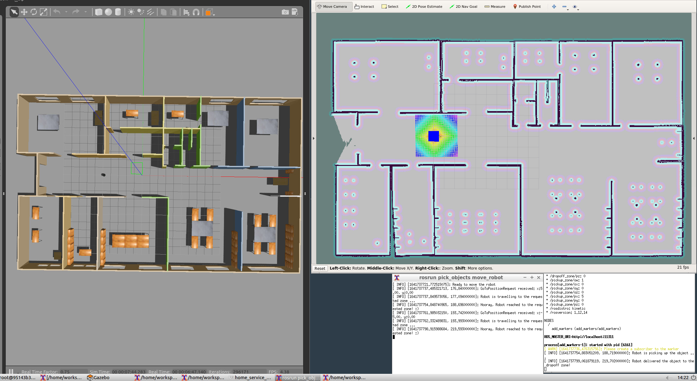
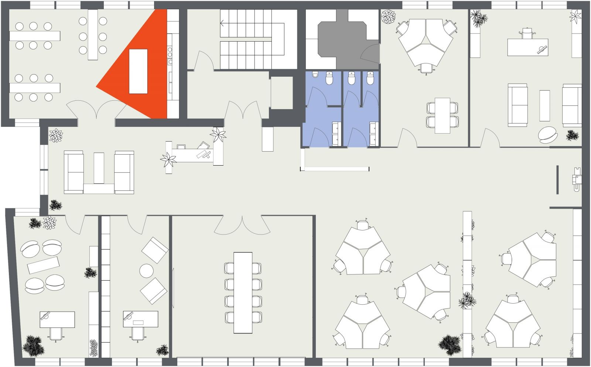
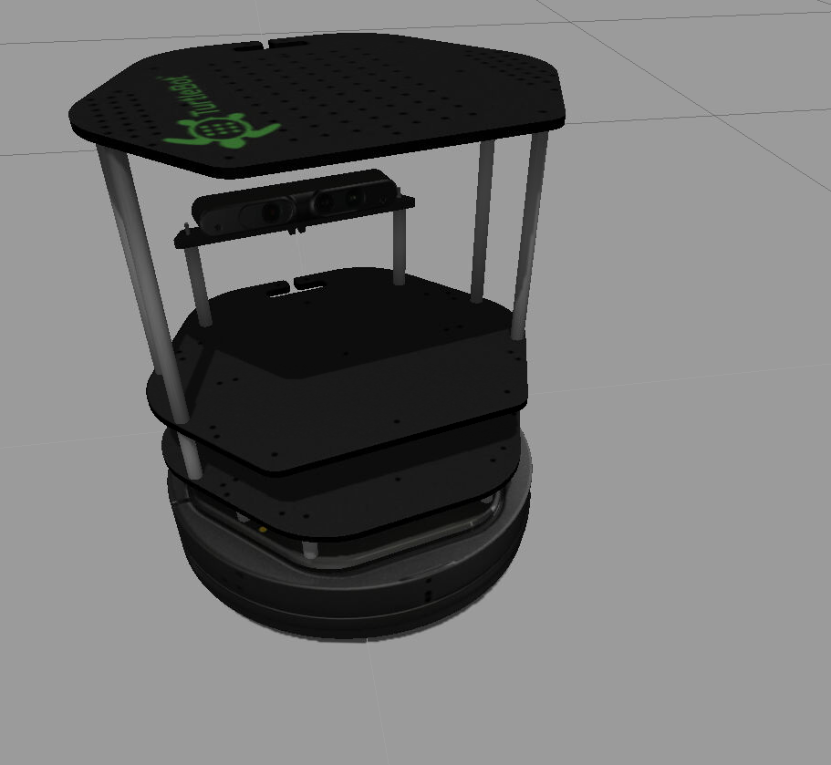
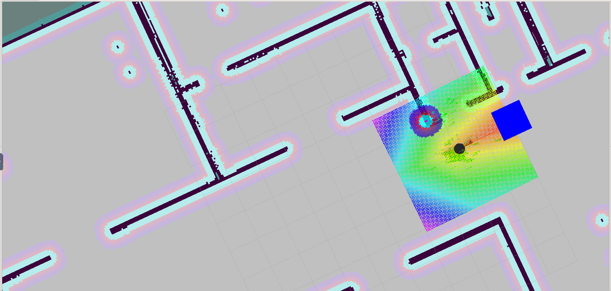

# home_service_robot

Udacity's Robotic SW Engineer Course - Fifth Project: Home Service Robot!

The project is about mapping, localizing and path planning for a mobile robot in a gazebo world. It consist of five packages:
*  [`gmapping`](http://wiki.ros.org/gmapping): to perform SLAM and build a map of the environment with a robot equipped with laser range finder sensors or RGB-D cameras. 
*  [`turtlebot_gazebo`](http://wiki.ros.org/turtlebot_gazebo): to deploy a turtlebot in a gazebo environement by linking a world file to it.
* [`turtlebot_rviz_launchers`](http://wiki.ros.org/turtlebot_rviz_launchers): to load a pre-defined rviz workspace that will automatically load the robot model, trajectories and the map.
* [`turtlebot_teleop`](http://wiki.ros.org/turtlebot_teleop): to manually control a robot using keyboard commands.
* `pick_objects`: to plan and drive the robot to the goal positions to pickup/dropoff some virtual objects.
* `add_markers`: to specify the pickup/dropoff zones for the robot and to draw them for visualization on rviz.

### Task:
* Initially the marker (i.e. virtual object to be picked up) is shown at the pickup zone.
* Robot should drive to the pickup zone and marker should hide once the robot reaches there.
* Robot should wait for 5 seconds to simulate a pickup.
* Robot should drive to the dropoff zone and marker should drawn once the robot reaches there (to simulate a dropoff).

### Implementation Details:
For Mapping the environment, `gmapping` package is used while the robot is driven around manually; the generated map is saved using the [`map_saver`](http://wiki.ros.org/map_server) to the map folder (`maymap.pgm`, `mymap.yaml`).

For localization, [`amcl`](http://wiki.ros.org/amcl) algorithm is used; initial guess for the robot pose is set to `(x=0, y=0, theta=0)` by moving around, robot updates its beliefs based on the laser scan and odometry data to localize itself in the environment.

For planning, ROS navigation stack creates a path based on `Dijkstra's` algorithm, a variant of the `Uniform Cost Search` algorithm, while avoiding obstacles on its path.

For communicating between `pick_objects` and `add_markers` nodes, [`ros_services`](http://wiki.ros.org/Services) is used. `add_markers` sends a request to `pick_objects` node to drive the robot to the specified location and waits for the response (whether it was successful or not).




The structure of the project is shown below:

### Project Structure

    |
    |
    ├── slam_gmapping                       # gmapping_demo.launch file
    │   ├── gmapping
    │   ├── ...

    ├── turtlebot                           # keyboard_teleop.launch file
    │   ├── turtlebot_teleop
    │   ├── ...
    ├── turtlebot_interactions              # view_navigation.launch file
    │   ├── turtlebot_rviz_launchers
    │   ├── ...
    ├── turtlebot_simulator                 # turtlebot_world.launch file
    │   ├── turtlebot_gazebo
    │   ├── ...
    |
    ├── pick_objects                        # pick_objects C++ node
    │   ├── src/pick_objects.cpp
    │   ├── ...
    ├── add_markers                         # add_marker C++ node
    │   ├── src/add_markers.cpp
    │   ├── ...
    ├── map                                 # map files
    │   ├── ...
    ├── world                               # myWorld.world file
    │   ├── ...
    ├── scripts                             # shell script files
    │   ├── ...
    ├── rvizConfig                          # rviz configuration files
    │   ├── ...
    └──
    

### World

The world is consist of mainly the office floor which the plan is taken from [roomsketcher.com](https://www.roomsketcher.com/floor-plan-gallery/325/office-floor-plan-examples/contemporary-office-floor-plan/) (as shown below):


### Robot

The robot is the TurtleBot2 consist of Kobuki base and a Kinect 3D camera.

|               3D Model                |               RVis Visualization                |
| :-----------------------------------: | :---------------------------------------------: |
|  |  |

## Getting Started

- Create a `catkin_ws` directory and `cd` to it:
  ```
  mkdir catkin_ws
  cd catkin_ws
  ```
- Clone this repo inside `catkin_ws`:

  ```
  git clone https://github.com/Jeyhooon/home_service_robot.git
  ```
- Change directory to the `src` folder:
  ```
  cd src
  ```
- Clone other required packages:
  ```
  git clone https://github.com/ros-perception/slam_gmapping
  git clone https://github.com/turtlebot/turtlebot
  git clone https://github.com/turtlebot/turtlebot_interactions
  git clone https://github.com/turtlebot/turtlebot_simulator
  ```
- Modify the turtlebot gazebo launch file (at `src/turtlebot_simulator/turtlebot_gazebo/launch/turtlebot_world.launch`) to launch our custom world (modify `world_file` argument as below):
  ```
  <arg name="world_file" default="$(find add_markers)/../../world/myWorld.world"/>
  ```
- Get back to the root directory: 
  ```
  cd ..
  catkin_make
  source devel/setup.bash
  ```
- Give execution permission to the bash script in the scripts folder:
  ```
  chmod +x src/scripts/home_service.sh
  ```
- Now, to launch the project, run this scripts:
  ```
  bash src/scripts/home_service.sh
  ```
  It launches all the required nodes one by one in their own terminal.
